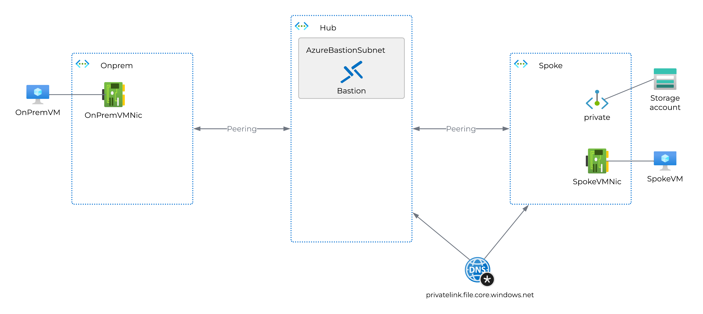
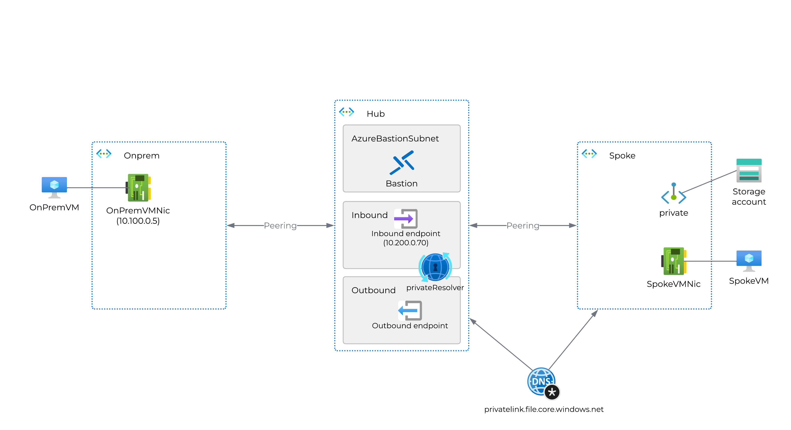

# Private Resolver demo environment
This bicep template will create a demo environment for the private resolver feature in Azure.
You can opt for creating a fully working setup with private resolver right away, or you can deploy a setup without the private resolver and manually add that. The latter is useful if you want to learn how to add private resolver to an existing environment.

https://youtu.be/V7tHg_954t8?si=hbi73Gj09fWCxmU5

Prerequisites:
- Bicep installed
- Azure Powershell modules:
    - Az.Accounts
    - Az.Resources
- A pre-existing resource group

## Lab environment without Private Resolver
This will create three vNets, two VMs, Bastion and a storage account complete with private endpoint.
Diagram:

### Deployment
Deploy the lab environment without private resolver by using the following command:
```powershell
Connect-AzAccount -Tenant 'xxxx-xxxx-xxxx-xxxx' -SubscriptionId 'yyyy-yyyy-yyyy-yyyy'

Account                SubscriptionName TenantId                Environment
-------                ---------------- --------                -----------
azureuser@contoso.com  Subscription1    xxxx-xxxx-xxxx-xxxx     AzureCloud
$subscriptionId= (Get-AzContext).Subscription.id
az account set --subscription $subscriptionId
$resourceGroupName="rg-dns-private-resolver"
New-AzResourceGroup -Name $resourceGroupName -Location "westeurope"
New-AzResourceGroupDeployment -Name "FirstStage" -ResourceGroupName $resourceGroupName -TemplateFile main.bicep -Stage FirstStage
```

### Verifying functionality without Private Resolver
First, grab the name of your deployed storage account.    
Then log on to both VMs and verify the following:
- From OnPremVM:
    - Resolve local DNS zone (should work):
        ```powershell
        Resolve-DnsName onpremhost.logcorner.local
        ```
    - Resolve Azure DNS zone (should point to public IP):
        ```powershell
        Resolve-DnsName logcornerstprivdnsrev.file.core.windows.net
        Resolve-DnsName  logcornerstprivdnsrev.blob.core.windows.net
        ```
- From spokeVM:
    - Resolve local DNS zone (should fail):
        ```powershell
        Resolve-DnsName onpremhost.logcorner.local
        ```
    - Resolve Azure DNS zone (should point to private IP):
        ```powershell
        Resolve-DnsName logcornerstprivdnsrev.file.core.windows.net
        Resolve-DnsName  logcornerstprivdnsrev.file.core.windows.net
        ```
If these tests produce the expected results, the environment is working as intended.   
That means you can go ahead and add the Private Resolver manually. Alternatively, you can extend the environment by deploying the private resolver as well by following the next section.

## Lab environment with Private Resolver
This will create the same environment as above, but with the private resolver and necessary links and endpoints in place.   
Diagram:

### Deployment
Deploy the lab environment with private resolver by using the following command:
```powershell
New-AzResourceGroupDeployment -Name "EndStage" -ResourceGroupName rg-dns-private-resolver -TemplateFile main.bicep -Stage EndStage
```

### Verifying functionality with Private Resolver
First, grab the name of your deployed storage account.    
Then log on to both VMs and verify the following:
- From OnPremVM:
    - Resolve local DNS zone (should work):
        ```powershell
        Resolve-DnsName onpremhost.logcorner.local
        ```
    - Resolve Azure DNS zone (should point to private IP):
        ```powershell
        Resolve-DnsName logcornerstprivdnsrev.file.core.windows.net
        ```
- From spokeVM:
    - Resolve local DNS zone (should work):
        ```powershell
        Resolve-DnsName onpremhost.logcorner.local
        ```
    - Resolve Azure DNS zone (should point to private IP):
        ```powershell
        Resolve-DnsName logcornerstprivdnsrev.file.core.windows.net
        ```

## Troubleshooting
From time to time the Bicep deployments will fail for various reasons. I find that usually you can just rerun the deployment and it will work. If it doesn't, you can try to remove the resource group and start over.


## notes 
0. deploy the dns private resolver inside a vnet
1. Private dns resolver inbound enpoint : use a private ip adress from the vnet 
2. Configure onpremise dns with a conditional forwarder  , with dns domain file.core.windows.net and the private ip of the dns resolver inbound endpoint

3. the inbound and outbound subnet should be delegated to  Microsoft.Network/dnsResolvers

4. inbound endpoint should resolve private endpoint

5. for outbound endpoint use the outbound subnet

6. create a dns rulesut and use the outbound of the dns private resolver
add a rule with domain mane of   logcorner.local.  and destination ip addrees is the private of the on premise dns server  (ex : 10.100.0.5) , port is 53
7. link the ruleset to the hub vnet
8. spokevnet should use the dnsserver : custom with ip address of private dns resolver inbound ip ( 10.200.0.70)


# ###################################################
nslookup logcornerstprivdnsrev.file.core.windows.net
Server:  UnKnown
Address:  168.63.129.16

Non-authoritative answer:
Name:    logcornerstprivdnsrev.privatelink.file.core.windows.net
Address:  10.201.0.5
Aliases:  logcornerstprivdnsrev.file.core.windows.net


Server:  UnKnown
Address:  10.200.0.70

Non-authoritative answer:
Name:    logcornerstprivdnsrev.privatelink.file.core.windows.net
Address:  10.201.0.5
Aliases:  logcornerstprivdnsrev.file.core.windows.net